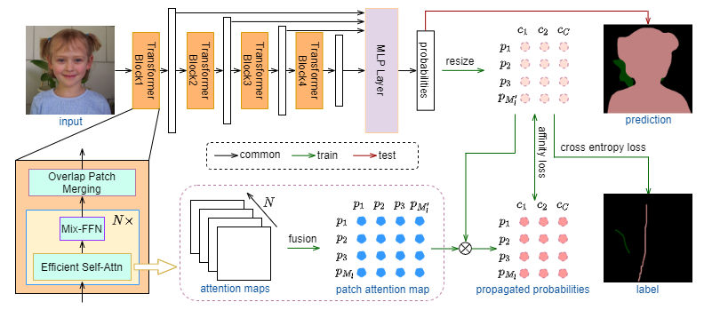
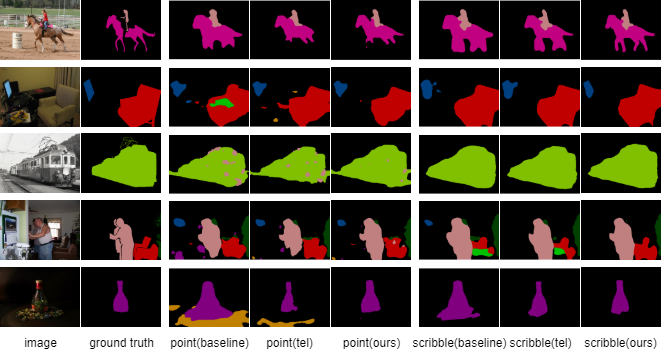

# SASFormer: Transformers for Sparsely Annotated Semantic Segmentation


## Introduction
This repository is an official implementation of paper [SASFormer: Transformers for Sparsely Annotated Semantic Segmentation]().



**Abstract.** Semantic segmentation based on sparse annotation has advanced in recent years. It only labels part of each object in the image, leaving the remainder unlabeled. Most of existing approaches are time-consuming and often necessitate a multi-stage training strategy. While in this work, we propose a simple yet effective sparse annotated semantic segmentation framework based on segformer, dubbed SASS, that achieves remarkable performance. Specifically, the framework first generates hierarchical patch attention maps, which are then multiplied by the network predictions to produce correlated regions separated by valid labels. Besides, we also introduce the affinity loss to ensure the consistency between the features of correlation results and network predictions. Extensive experiments showcase that our proposed approach is superior to existing methods and achieves the cutting-edge performance.

## News
(05/12/2022) Update codes and models. 

## Main Results
|  **Method**  | **Backbone** | **Dataset**  |  **Annotation**  |  **mIoU**  |  **Model**  |
|:------:|:------:|:------:|:------:|:------:| :------:| 
| SASFormer | Segformer | VOC2012    | scribble | 79.49 | [baidu](https://pan.baidu.com/s/1Xo7o3fOqQV_YywqV2fPHYA (0311))
| SASFormer | Segformer | VOC2012    | point | 73.13 | [baidu](https://pan.baidu.com/s/1ZEHObwvqBZ6oSaVorXXr1g (0311))


## Requirements
* Linux, Python>=3.6, CUDA>=10.0, pytorch == 1.7.1

## Installation
git clone https://github.com/su-hui-zz/SASFormer.git
cd SASFormer

### Sparse Annotation Preparation
* Please first follow the [Getting Started](https://github.com/openseg-group/openseg.pytorch/blob/master/GETTING_STARTED.md) for data preparation.
* Download [scribble and point annotations](https://github.com/LEONOB2014/GatedCRFLoss/tree/master/datasets) provided by GatedCRFLoss Finally, the dataset directory should look like:
```
$DATA_ROOT
├── voc2012
│   ├── voc_scribbles.zip
│   ├── voc_whats_the_point.json
│   └── voc_whats_the_point_bg_from_scribbles.json
```

### Point-supervised and Scribble-supervised Settings  
Supervised type can be rewrite as "scribble" or "point" in "annotation" of configs/voc2012/Segformerb4_512_3.json, we train and val in default scribble-supervised type.

* bash scripts/voc2012/segf/train_b4_512_3.sh train (export CUDA_VISIBLE_DEVICES=0,1,2,3)
* bash scripts/voc2012/segf/train_b4_512_3.sh val (export CUDA_VISIBLE_DEVICES=2)

Before training, we should put mix-transformer pre-trained weights in "./pretrained" directory. Pre-trained weight is also provided in [baidu](https://pan.baidu.com/s/1YWyn5uOocAiCjctsAW0Gyw  (0311))
Before validation, we should load our trained weights, and put weights path in "--resume" of train_b4_512_3.sh.


## Performance
We provide some visualization results as follows to show our superiority.



## Contacts
If you have any question about our work or this repository, please don't hesitate to contact us by emails.
- [suhui@zhejianglab.com]
- [chenglc@zhejianglab.com]

## Acknowledgment
Our project references the codes of  [Tree Energy Loss: Towards Sparsely Annotated Semantic Segmentation (github.com)](https://github.com/megvii-research/TreeEnergyLoss) and [SegFormer: Simple and Efficient Design for Semantic Segmentation with Transformers (github.com)](https://github.com/open-mmlab/mmsegmentation/tree/master/configs/segformer). Thanks for their works and sharing.

## Cite
@misc{su2022sasformer,
    title={SASFormer: Transformers for Sparsely Annotated Semantic Segmentation},
    author={Hui Su and Yue Ye and Wei Hua and Lechao Cheng and Mingli Song},
    year={2022},
    eprint={2212.02019},
    archivePrefix={arXiv},
    primaryClass={cs.CV}
}
